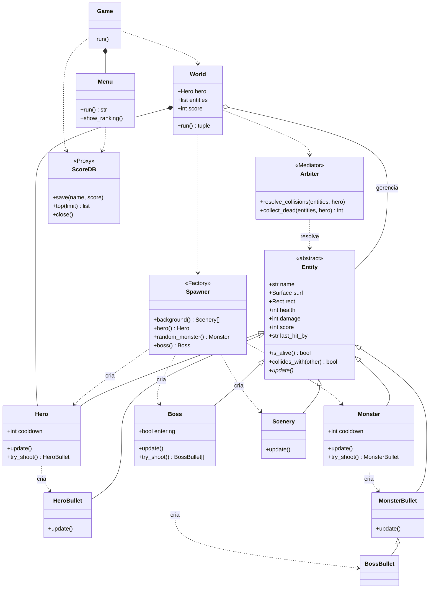

# Diagrama de Classes — Cordel Shooter

Visão geral da arquitetura orientada a objetos do jogo. `Entity` é a
classe base abstrata; as demais entidades a especializam (herança). Os
padrões **Factory** (`Spawner`), **Mediator** (`Arbiter`) e **Proxy**
(`ScoreDB`) organizam criação, interação e persistência.

## Condições do jogo (atividade)

- **Controle do jogador:** `Hero.update()` (setas/WASD) e `Hero.try_shoot()` (espaço).
- **Desafio:** `Monster`/`Boss` descem e atiram; `Arbiter` resolve as colisões.
- **Vitória:** derrotar a `Boss` (Cuca) — `World.run()` retorna `"win"`.
- **Derrota:** vida do `Hero` chega a zero — `World.run()` retorna `"lose"`.
